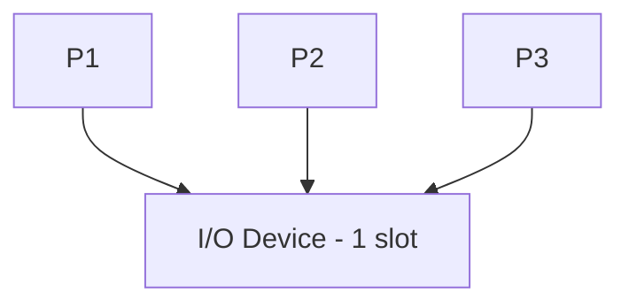
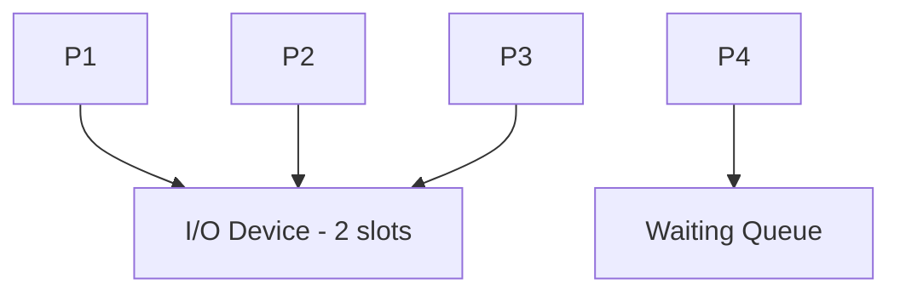

# OSG  
## Cơ chế đồng bộ I/O (I/O Synchronization)

---

## Mutex (Mutual Exclusion)

### 1. Giới thiệu
- Chương trình mô phỏng cơ chế **Mutex**
- Nguyên tắc:  
  + Chỉ **1 tiến trình** được truy cập tài nguyên I/O tại một thời điểm  
- Dùng để tránh **race condition**
- Là cơ chế **đồng bộ cơ bản nhất**

### 2. Thuật toán
- Tạo nhiều tiến trình (thread)
- Khi tiến trình muốn truy cập I/O:
  + Gọi `lock()` để chiếm quyền
  + Nếu đã có tiến trình khác giữ lock → phải chờ
- Sau khi hoàn thành:
  + Gọi `unlock()` để giải phóng tài nguyên

### 3. Mô hình hoạt động


### 4. Đặc điểm
- Đơn giản, dễ hiểu  
- Đảm bảo an toàn tuyệt đối  
- Có thể gây **tắc nghẽn (blocking)** nếu nhiều tiến trình chờ  

### 5. Cách chạy chương trình
- Chạy file Python:
```bash
python main.py
```
- Chọn:
```text
1
```

---

## Semaphore

### 1. Giới thiệu
- Chương trình mô phỏng **Semaphore**
- Nguyên tắc:  
  + Cho phép **n tiến trình** truy cập tài nguyên cùng lúc  

### 2. Thuật toán
- Khởi tạo semaphore với giá trị n
- Khi tiến trình yêu cầu I/O:
  + Giảm semaphore (`acquire`)
  + Nếu = 0 → tiến trình phải chờ
- Khi hoàn thành:
  + Tăng semaphore (`release`)

### 3. Mô hình hoạt động


### 4. Đặc điểm
- Linh hoạt hơn Mutex  
- Tối ưu hiệu suất  

### 5. Cách chạy chương trình
```bash
python main.py
```
Chọn:
```text
2
```

---

## Condition Variable / Monitor

### 1. Giới thiệu
- Tiến trình **chờ đến khi điều kiện xảy ra**
- Dùng trong bài toán Producer – Consumer  

### 2. Thuật toán
- Producer:
  + Tạo dữ liệu → đưa vào buffer
  + `notify()`
- Consumer:
  + Nếu rỗng → `wait()`
  + Có dữ liệu → xử lý

### 3. Mô hình hoạt động


### 4. Đặc điểm
- Đồng bộ theo điều kiện  
- Tránh busy waiting  

### 5. Cách chạy chương trình
```bash
python main.py
```
Chọn:
```text
3
```

---

## Tổng kết

| Cơ chế | Số tiến trình | Ứng dụng |
|------|--------|----------|
| Mutex | 1 | Khóa tài nguyên |
| Semaphore | n | Giới hạn truy cập |
| Condition | n | Đồng bộ điều kiện |

👉 Đây là nền tảng quan trọng trong hệ điều hành
